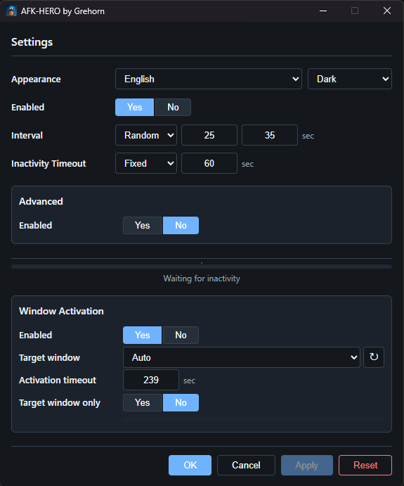

# AFK-Hero

[](https://github.com/grehorn-dev/afk-hero/actions/workflows/ci.yml)
[](LICENSE)



Windows desktop app that simulates mouse movement when user inactivity is detected. Sits in the system tray, 
keeps your session alive and optionally brings a target/game window to the foreground.

## Features

- Automatic mouse movement using closed geometric paths with configurable direction, distance and speed
- Movement injection via relative steps - no absolute jumps, no driver hooks
- User inactivity detection
- Fixed and Random modes for every numeric parameter
- Window Activation - auto-detect fullscreen/borderless games/apps or pick a window manually; activate it after a configurable timeout
- Translation into dozens of languages, including right-to-left support
- Dark / Light themes support
- System tray icon with localized context menu
- Config persisted in `%APPDATA%/afk-hero/`
- Single-instance enforcement

## System Requirements

- Windows 10/11 x64
- Microsoft Edge WebView2 Runtime - pre-installed on Windows 11 and recent Windows 10 updates. If missing, download the **Evergreen Bootstrapper** from [developer.microsoft.com/en-us/microsoft-edge/webview2](https://developer.microsoft.com/en-us/microsoft-edge/webview2#download) and run it - no reboot required.

## Building from Source

### Prerequisites

- [Go 1.26+](https://go.dev/dl/)
- [Node.js 18+](https://nodejs.org/)
- [Wails CLI](https://wails.io/): `go install github.com/wailsapp/wails/v2/cmd/wails@latest`
- GCC toolchain for `go test -race` (recommended: `winget install -e --id BrechtSanders.WinLibs.POSIX.UCRT`)
- [golangci-lint](https://golangci-lint.run/) (recommended: `winget install -e --id GolangCI.golangci-lint`)

### Commands

```powershell
# Development (hot-reload)
wails dev

# Production build
wails build

# Full local verification
./scripts/verify.ps1
```

Build artifact: `build/bin/afk-hero.exe`

## Project Structure

```
├── main.go                    # Wails entrypoint
├── assets.go                  # Embedded frontend assets
├── internal/
│   ├── app/                   # Wails bindings, lifecycle
│   ├── appmeta/               # App metadata and window sizing
│   ├── bootstrap/             # Platform-specific startup wiring
│   ├── config/                # TOML config load/save/normalize
│   ├── domain/                # Types, state machine, settings
│   ├── geometry/              # Shapes, trajectories, interpolation
│   ├── i18n/locales/          # 57 embedded JSON translations
│   ├── logging/               # slog file logger
│   ├── platform/              # Capability interfaces + adapters
│   │   ├── windows/           # Win32 implementations
│   │   └── stubs/             # Non-Windows stubs
│   ├── runtime/               # Engine, animation, activation
│   ├── state/                 # Applied state store
│   └── tray/                  # System tray (getlantern/systray)
├── frontend/src/              # React + TypeScript + Vite UI
├── scripts/verify.ps1         # Quality gate script
└── .github/workflows/         # CI and release pipelines
```

## License

[MIT](LICENSE)
